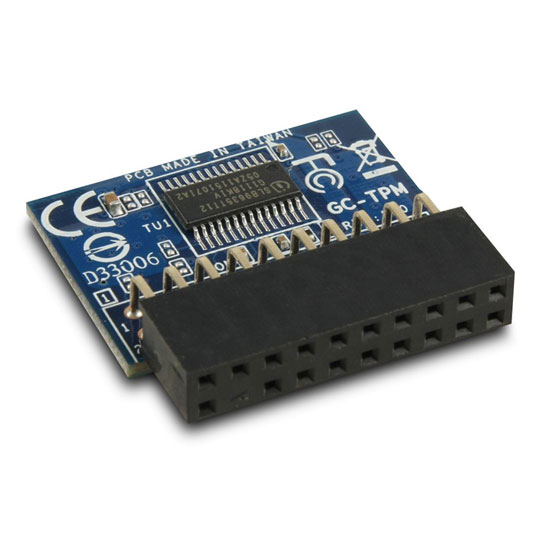
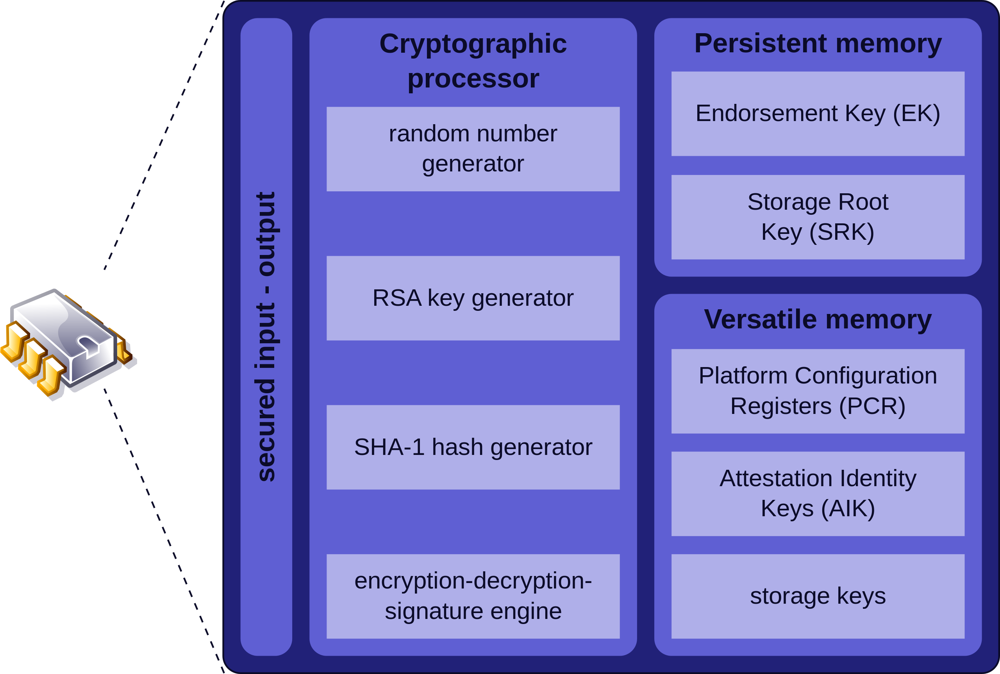

# Trusted Platform Module (TPM)

TPM (Trusted Platform Module) to mikroukład, który został opracowany przez grupę Trusted Computing Group (TCG) – zapewnia podstawę bezpieczeństwa komputera.

Układ TPM bezpiecznie przechowuje unikalny klucz szyfrujący i w ten sposób znacząco utrudnia dostęp do danych komputera niepowołanym osobom.

Układy TPM poza bezpiecznym przechowywaniem kluczy szyfrujących, zapewniają skuteczną ochronę certyfikatom i hasłom używanym do logowania się do systemu – jest to pewniejsza metoda niż przechowywanie ich na dysku twardym.

# Opis poszczególnych komponentów

- generator liczb losowych - realizowany za pomocą specjalnego hardware'u; losowe liczby powstają wskutek procesu fizycznego zamiast algorytmu
- generator hashów i podpisów cyfrowych

- Endorsement Key (EK) - unikalny i tajny klucz wypalony w procesie produkcji.
- Storage Root Key (SRK) - powstaje kiedy zaczynamy używać moduł, służy do ochrony kluczy trzymanych poza TPM stworzonych przez inne aplikacje. W ten sposób klucze te nie mogą być używane bez TPM. 
- Platform Configuration Registers (PCR) - The Platform Configuration Registers (PCR) are unique features of the TPM architecture and are used to store integrity metrics. The integrity metrics stored in these registers measure the integrity of any code, from BIOS to applications, typically before the code is executed. Platform Configuration Registers (PCR) contain hashes which intended to be used for platform hardware and software integrity checking between boots.
- Attestation Identity Keys (AIK) - These keys may be regarded as an aliases for the Endorsement Key. An Attestation Identity Key is a special purpose TPM-resident RSA key that is used to provide platform authentication based on the attestation capability of the TPM.
- pozostałe klucze

# Zastosowania
Układy zgodne z TPM mogą obsługiwać wszystkie działania związane z kryptografią, w tym działania, w których producent rozwiązania nie życzy sobie ingerencji użytkownika w ich przebieg. Ponadto działanie TPM zbliżone jest do działania karty inteligentnej i w efekcie, przechowywany w układzie klucz prywatny nigdy go nie opuszcza ani nigdzie nie jest wysyłany. Znacząco utrudnia to jego zdalne przechwycenie, czyniąc to w praktyce niemożliwym.

„Nieprzejrzystość” operacji kryptograficznych sprawia, że układy TPM mogą być stosowane w rozwiązaniach DRM. Dobra ochrona klucza i ścisłe związanie z konkretnym egzemplarzem sprzętu pozwalają na tworzenie stosunkowo bezpiecznych rozwiązań szyfrujących dane, w szczególności dane na dyskach twardych. Przykładem implementacji może być mechanizm BitLocker stosowany w systemach Windows począwszy od wersji Vista.

# Dostępność
Wśród komputerów PC, najczęściej spotyka się układy TPM w laptopach. Wynika to z faktu, że dane na tych komputerach są bardzo mocno narażone na kradzież, a dzięki mechanizmom TPM mogą być chronione. Wśród komputerów typu desktop, układy TPM są stosunkowo rzadkie.

# TPM w Arch Linuxie
Sterowniki TPM są zawarte w nowszych kernelach Linuxa. Pakiet służący do komunikacji ze sterownikiem to `trousers` stworzony i wypuszczony przez IBM. Dodatkowo pakiet `tpm-tools` zawiera wiele przydatnych narzędzi do zarządzania TPM.

# TPM w Gnome Keyring
> No, there is no TPM integration yet. Such integration may be possible since the TrouSerS project includes a PKCS #11 interface to TPM, but we are not aware of any attempt to do so.

# Użyte materiały
https://en.wikipedia.org/wiki/Trusted_Platform_Module \
https://courses.cs.vt.edu/cs5204/fall10-kafura-BB/Papers/TPM/Intro-TPM-2.pdf \
https://trustedcomputinggroup.org/ \
https://docs.microsoft.com/en-us/windows/security/information-protection/tpm/trusted-platform-module-top-node \
https://wiki.archlinux.org/index.php/Trusted_Platform_Module \
https://wiki.gnome.org/Projects/GnomeKeyring/SecurityFAQ